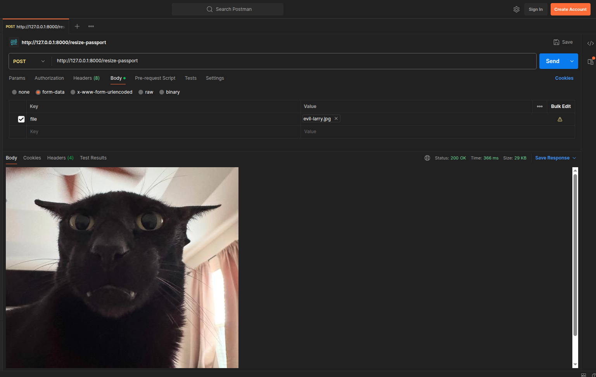
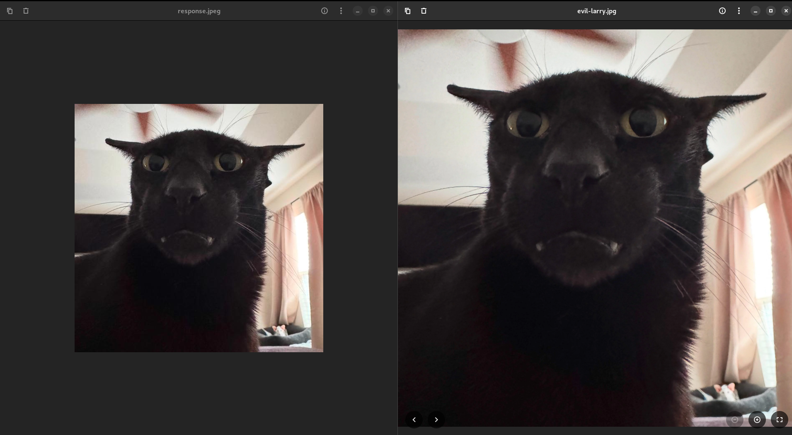

# PART 1: Passport Size Photo Maker API 

This is a simple FastAPI-based backend that processes an uploaded image and converts it into a passport-size photo (600x600 JPEG).

The goal of this project is not production usage, but to understand core backend and system design concepts step by step.


## What it does

```
The API:

Accepts an image upload
Converts image to RGB format
Center-crops the image into a square
Resizes it to 600x600 pixels
Returns the processed image directly in the response
```

## Request Flow

Client → FastAPI → Image Processing (Pillow) → Response Image

## Tech Stack

```
Python
FastAPI
Pillow (PIL)
Uvicorn
```

## API Endpoint

POST /resize-passport

Input: Image file

Output: processed JPEG image (600x600)

## What Part1 Teaches?

This Part is used to understand:
```
File upload handling in APIs
Binary data processing
Basic image processing (crop, resize)
Stateless API design
CPU-bound workloads inside APIs
```

## Limitations  (We will fix these limitations when we move forward)

This project is intentionally simple and has several limitations:

```
❗️ No Database

No job tracking

No history of uploads

No metadata storage

❗️ No Queue System

Image processing is synchronous

API waits until processing is complete

Not scalable for heavy load

❗️ No Cache Layer

Reprocesses the same image every time

No optimization for repeated requests

❗️ No Background Workers

CPU‑heavy tasks run inside the API process

Can block the server under load

❗️ No Scalability Design

Single‑process execution

No load balancing or distributed workers

❗️ Not Micro-service based

API is currenly standalone/monoloth.

Containerizing it would improve scaling.

```

## Learning Goal

Understand how a simple API evolves into a scalable system:

```
Monolith API → + DB → + Cache → + Queue → + Workers → Distributed System
```

## Sample Screenshots

Let's Just Say.......!

1. POST an image to API and API returns the image in 600*600 resolution.




2. Comparison of generated image vs actual raw image.



* First image is the converted passport size photo.

* Second one is the actual raw image.


## Dependencies 

```
pip install fastapi uvicorn pillow python-multipart

```


## How to Run the API?

```
python -m uvicorn main:app
```


# Next Step:

Check part2 to learn how to integrate a Database with this App.